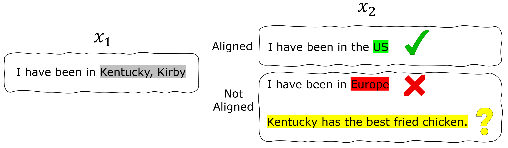

# Align: A Unified Text Alignment Function for NLP Tasks
Align measures the correspondence of information between two pieces of text, which is introduced in\
[Text Alignment Is An Efficient Unified Model for Massive NLP Tasks](https://arxiv.org/pdf/2307.02729.pdf)\
Yuheng Zha\*, Yichi Yang\*, Ruichen Li and Zhiting Hu\
NeurIPS 2023

For a given text pair $(x_1, x_2)$, **text information alignment** is to decide if all information in $x_2$ is supported by information in $x_1$. For example, given a text $x_1$: `I have been in Kentucky, Kirby`, text `I have been in the US` is aligned with $x_1$. However, either text `I have been in Europe` or text `Kentucky has the best fried chicken` is not aligned with $x_1$. 



Text alignment is applicable to a wide range of downstream tasks, e.g., Natural Language Inference, Paraphrase Detection, Fact Verification, Semantic Textual Similarity, Question Answering, Coreference Resolution and Information Retrieval.

## Installation

We recommend to install `Align` in a conda environment.

First clone this repo:

```bash
git clone https://github.com/yuh-zha/Align.git
cd Align
```

Create a virtual conda environment:

```bash
conda create -n Align python=3.9
conda activate Align
pip install -e .
```

Install the required spaCy model

```bash
python -m spacy download en_core_web_sm
```

## Checkpoints

We provide two versions of Align checkpoints: `Align-base` and `Align-large`. The `-base` model is based on RoBERTa-base and has 125M parameters. The `-large` model is based on RoBERTa-large and has 355M parameters.

Align-base: https://huggingface.co/yzha/Align/resolve/main/Align-base.ckpt

Align-large: https://huggingface.co/yzha/Align/resolve/main/Align-large.ckpt

## Usage

To get the alignment score of the text pairs (`text_a` and `text_b`), use the `scorer` function of Align:

```python
from align import Align

text_a = ["Your text here"]
text_b = ["Your text here"]

scorer = Align(model="roberta-large", batch_size=32, device="cuda", ckpt_path="path/to/ckpt")
score = scorer(contexts=text_a, claims=text_b)
```

`model`: The backbone model of Align. It can be `roberta-base` or `roberta-large` \
`batch_size`: The batch size of inference \
`ckpt_path`: The path to the checkpoint

## Citation

If you find this work helpful, please consider cite:

```
@inproceedings{
zha2023text,
title={Text Alignment Is An Efficient Unified Model for Massive {NLP} Tasks},
author={Yuheng Zha and Yichi Yang and Ruichen Li and Zhiting Hu},
booktitle={Thirty-seventh Conference on Neural Information Processing Systems},
year={2023},
url={https://openreview.net/forum?id=xkkBFePoFn}
}
```
